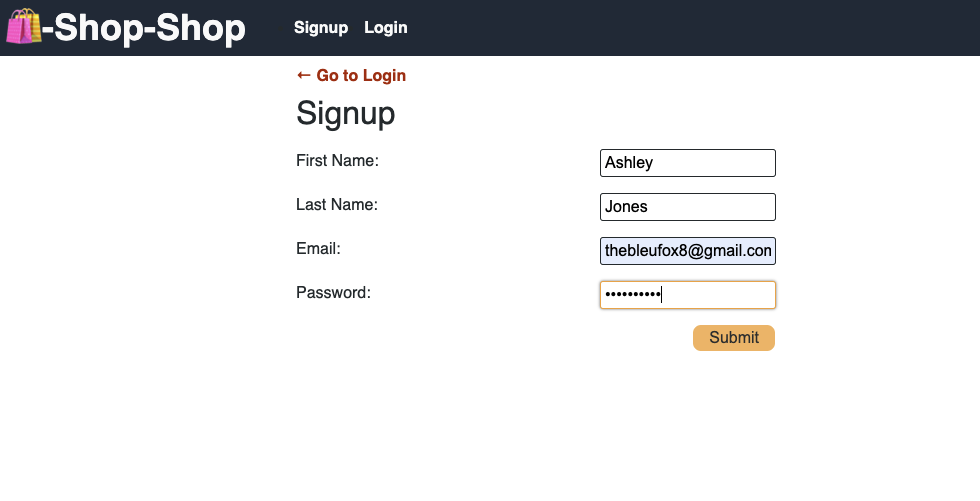

# Bleu's Redux Store - Homework 22

## Description
Redux store code refactoring homework.

## Acceptance Criteria
```md
GIVEN an e-commerce platform that uses Redux to manage global state
WHEN I review the app’s store
THEN I find that the app uses a Redux store instead of the Context API
WHEN I review the way the React front end accesses the store
THEN I find that the app uses a Redux provider
WHEN I review the way the app determines changes to its global state
THEN I find that the app passes reducers to a Redux store instead of using the Context API
WHEN I review the way the app extracts state data from the store
THEN I find that the app uses Redux instead of the Context API
WHEN I review the way the app dispatches actions
THEN I find that the app uses Redux instead of the Context API
```

## Technologies Used
* Javascript, HTML, CSS

## Screenshots
Homepage 


Sign Up


Logged In


## Repository
* GitHub Repo: https://github.com/bleufox/BleusReduxStore
* Heroku Deployment: https://redux-homework.herokuapp.com/

## Creator
Ashley Jones, Full Stack Developer Student
* Email: thebleufox8@gmail.com
* GitHub: https://github.com/bleufox